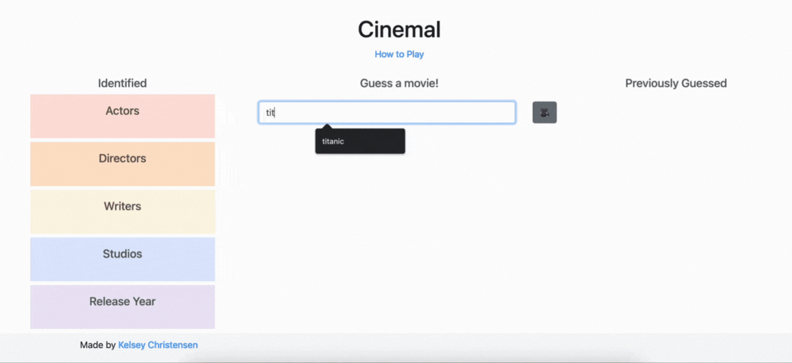
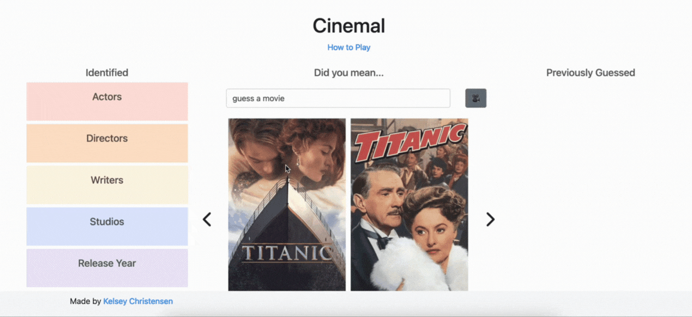

<h1 align="center">Cinemal Game</h1>

<p align="center">
Cinemal is Worlde-style movie-guessing game. 

Cinemal uses <a href="https://developer.themoviedb.org/reference/search-movie">The Movie Database API</a>
to generate a new movie, which is the answer, each day. 

When users make a guess, they can select their choice from a list of results to ensure their intended guess is recorded. 

If their guess is not correct, the movie details of their guess are weighed against the answer: 
if the release year is before or after the answer movie, if any of the actors, crew are the same, if the studio is the same, etc. 

This feedback is stored and displayed for the user on the left side. 

Previously guessed movies are stored on the right side. 

## Links

- [Repo](https://github.com/kelseychristensen/cinemal-master "Cinemal")

## Screenshots

#### Step 1: Start Screen

#### Step 2: Entering a guess, get search results

#### Step 3: Select a result to make a guess, get first round of feedback

#### Feedback/stored info after several guesses

#### Step 4: Win Screen


### Built with

- Python
- Jinja
- Flask
- HTML
- CSS
- <a href="https://developer.themoviedb.org/reference/search-movie">The Movie Database API</a>

### Resources

<a href="https://developer.themoviedb.org/reference/search-movie">The Movie Database API</a>

### Continued development

Future versions would include: 
<ul>
<li>Ability for user to social share their results (number of guesses until finding the answer)</li>
<li>Ability for users to create an account which stores analytics of their scores (e.g. average number of guesses)</li>
<li>Detection to prevent users from playing the puzzle more than once per day.</li>
<li>Prevention of Cinemal from picking the same movie twice in recent succession.</li>
<li>Bespoke UI for mobile and tablet.</li>

</ul>

### Sample Snippets

```python
class GetGuessDetails:

    def __init__(self, guess_id):
        # COLLECT THE CORRECT MOVIE FROM RESULTS BASED ON USER'S FEEDBACK ON LIST OF RESULTS
        self.movie_id = guess_id
        self.api_key = "d74cd897587a2b6545be2c6430c4f63b"

        # API CALL FOR MOVIE USER SELECTED
        self.new_endpoint = f"https://api.themoviedb.org/3/movie/{self.movie_id}"
        self.response = requests.get(url=self.new_endpoint, params={"api_key": self.api_key})
        self.movie = self.response.json()

        # API CALL FOR MOVIE CREDITS OF MOVIE USER SELECTED

        self.credits_endpoint = f"{self.new_endpoint}/credits"
        self.creds_response = requests.get(url=self.credits_endpoint, params={"api_key": self.api_key})
        self.creds = self.creds_response.json()
        self.movie_details = {
            "id": self.movie_id,
            "title": self.movie['title'],
            "release_year": self.movie['release_date'].split("-")[0],
            "studio": [company['name'] for company in self.movie['production_companies']],
            "actor": [actor['name'] for actor in self.creds['cast']],
            "director": [crew_member['name'] for crew_member in self.creds['crew'] if crew_member['job'] == "Director"],
            "writer": [crew_member['name'] for crew_member in self.creds['crew'] if crew_member['job'] == "Screenplay"],
        }
```
```html


                <div class="text"><h5>{{text}}</h5></div>

                <div id="guess_form" class="container-fluid">
                    <div class="row">
                        <div class="col-11">
                            <form class="guess_form" method="post">
                            <input value="guess a movie" name="guess" onfocus="this.value=''" id="guess" class="form-control">
                        </div>

                        <div class="col-1">
                            <input type="submit" value="🎥" class="btn btn-secondary" href="{{ url_for('home')}}">
                        </div>
                        </form>
                    </div>
                </div>

            
```
```css

.options_element {
    scroll-behavior: smooth;
    padding-top: 2%;
    display: flex;
    flex-wrap: nowrap;
    overflow-x: scroll;
    -ms-overflow-style: none;
    scrollbar-width: none;
}

.options_element::-webkit-scrollbar {
  display: none;
}
```

## Author

Kelsey Christensen

- [Profile](https://github.com/kelseychristensen "GitHub")
- [Email](mailto:kelsey.c.christensen@gmail.com?subject=Hi "Email")
- [Dribble](https://dribbble.com/kelseychristensen "Dribble")
- [Website](http://kelseychristensen.com/ "Website")